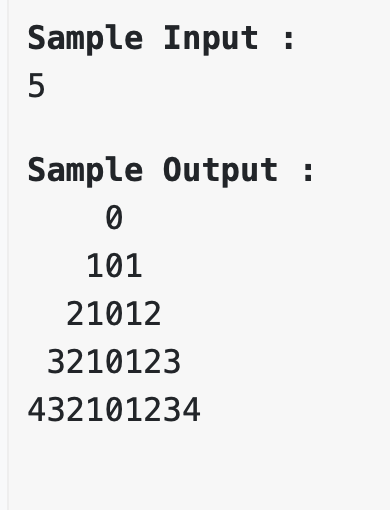

# Problem Solving Sessions

[x] Day 1: Problem Solving Techniques  
[x] Day 2: Patterns  
[x] Day 3: Arrays - Basics + Hashing
[x] Day 4: Arrays - Advanced + Hashing + Two Pointers + Recursion
[x] Day 5: Strings - Basics
[x] Day 6: Strings - Advanced
[ ] Day 7: Sorting Algorithms + Time and Space Complexity  
[ ] Day 8: Searching Algorithms  
[ ] Day 9: Linked Lists  
[ ] Day 10: Stacks and Queues

## Day 1: Problem Solving Techniques + Time and Space Complexity

- Problem Solving Techniques
- Interview Problem - How to approach and solve
- Time Complexity - Big O Notation

**Question:** Given a number, Check if the number is a even number or an odd number.

Approach 1: Divisibility by 2

1. Take a number as input <- number
2. Find the remainder of the number when divided by 2
3. If the remainder is 0, then the number is even, else the number is odd

Algorithm 2: Multiplying by 5

1. Take a number as input <- number
2. Multiply the number by 5
3. If the last digit of the number is 0 or 5, then the number is even, else the number is odd

Algorithm 3: Bitwise AND

1. Take a number as input <- number
2. Perform a bitwise AND operation between the number and 1
3. Step 2 will give 1 if the last bit of the number is 1, else 0
4. If the result is 1, then the number is odd, else the number is even

Algorithm 4: Checking the last digit

1. Take a number as input <- number
2. Check the last digit of the number
3. If the last digit is 0, 2, 4, 6, or 8, then the number is even, else the number is odd

Problem: Given two numbers, check whether they are amicable numbers or not.

Example:

220 and 284 are amicable numbers.

Divisors of 220: 1, 2, 4, 5, 10, 11, 20, 22, 44, 55, 110
Sum of divisors of 220: 1 + 2 + 4 + 5 + 10 + 11 + 20 + 22 + 44 + 55 + 110 = 284

Divisors of 284: 1, 2, 4, 71, 142
Sum of divisors of 284: 1 + 2 + 4 + 71 + 142 = 220

In summary, the sum of the divisors of the first number is equal to the second number and the sum of the divisors of the second number is equal to the first number.

Algorithm: Brute Force Technique

1. Take two numbers as input <- number1, number2
2. Find the divisors of the first number <- divisors1
3. Find the divisors of the second number <- divisors2
4. Find the sum of the divisors of the first number <- sum1
5. Find the sum of the divisors of the second number <- sum2
6. If sum1 is equal to number2 and sum2 is equal to number1, then the numbers are amicable numbers
7. Else, the numbers are not amicable numbers

Testing the algorithm with multiple test cases:

Positive Test Cases: These are the test cases where the algorithm should work as expected.

Input:

220 284

Output:

Amicable numbers

Input:

1184 1210

Output:

Amicable numbers

Negative Test Cases: These are the test cases where the algorithm should not work as expected.

Input:

220 285

Output:

Not amicable numbers

Input:

1184 1211

Output:

Not amicable numbers

Boundary Test Cases: These are the test cases where the algorithm should work at the edge cases.

Input:

1 1

Output:

Not amicable numbers

Input:

1 2

Output:

Not amicable numbers

Edge Test Cases: These are the test cases where the algorithm should work at the extreme edge cases.

Input:

0 0

Output:

Not amicable numbers

Input:

0 1

Output:

Not amicable numbers

### Problem Solving Techniques

1. Understand the problem statement
2. Dry run the problem with an example
3. Write the algorithm
4. Testing the algorithm with multiple test cases
5. Write the code for the algorithm
6. Test the code with multiple test cases
7. Analyze the time and space complexity of the code
8. Optimize the code if possible

   Note: In above steps, whenever possible, we need to break the problem into smaller subproblems and solve them individually

# Homeworks

1. Given a number, check if it is a prime number or not.
2. Given a number, check if it is a palindrome number or not.
3. Given a number, check if it is a perfect number or not.
4. Given a number, check if it is a happy number or not.
5. Given a number, check if it is a fibonacci number or not.
6. Given a number, check if it is a armstrong number or not.
7. Given two numbers, find the greatest common divisor (GCD) of the two numbers.
8. Given two numbers, find the least common multiple (LCM) of the two numbers.
9. Given a number, find the factorial of the number.
10. Given a number, find the sum of the digits of the number.
11. Given a number, find the reverse of the number.
12. Given a number, find the number of digits in the number.
13. Given a number, find the number of prime factors of the number.
14. Find the nth number in the fibonacci sequence.
15. Find the nth prime number.

## Day 2: Patterns

## Day 3: Arrays - Basics

### Homeworks

1. Given an array of integers, find the frequency of each element in the array.
2. Given an array of integers, find the number of duplicates in the array.
3. Given an array of integers, find the number of unique elements in the array.
4. Given an array of integers, remove the duplicates from the array.
5. Given an array of integers, find the first non-repeating element in the array.
6. Given an array of integers, find the first repeating element in the array.
7. Given an array of integers, find the second largest element in the array.
8. Given an array of integers, find the maximum frequency of an element in the array.
9. Given an array of integers, find the minimum frequency of an element in the array.
10. Given a String, find the frequency of each character in the String and print as like 'a2b3c4d5'.
11. Given a string, find the first non-repeating character in the string.
12. Given a string, find the first repeating character in the string.
13. Given two arrays, find the common elements between the two arrays.
14. Given two arrays, find the union of the two arrays.
15. Given two arrays, find the intersection of the two arrays.
16. Given an array of integers and the number, find only the factors of the number in the array.
17. Given two sorted arrays, merge the two arrays into a single sorted arrays.

## Day 4: Arrays - Advanced

### Homeworks

1. Given an array of integers, find the maximum sum of the subarray.
2. Given an array of integers, find the minimum sum of the subarray.
3. Given an array of integers, find the maximum product of the subarray.
4. Given an array of integers, find the second largest number in the array.
5. Given an array of integers, find the kth largest number in the array.
6. Given two arrays, find the median of the two arrays.
7. Given an array of integers, print the next greater element for each element in the array.
8. Given two arrays, check if the array is a rotated array of another array.
9. Given an array of integers, find the maximum difference between two elements in the array.
10. Given an array of integers, find the maximum difference between two elements in the array such that the smaller element appears before the larger element.

## Day 5: Strings - Basics

### Homeworks

1. Given a string, find the frequency of each character in the string.
2. Given a string, find the number of duplicates in the string.
3. Given a string, find the number of unique characters in the string.
4. Given a string, remove the duplicates from the string.
5. Given a string, find the first non-repeating character in the string.
6. Given a string, find the first repeating character in the string.
7. Given two strings, find the common characters between the two strings.
8. Given two strings, find the union of the two strings.
9. Given two strings, find the intersection of the two strings.
10. Given a string, find the frequency of each word in the string.
11. Given a string, find the first non-repeating word in the string.
12. Given a string, find the first repeating word in the string.
13. Given two strings, find the common words between the two strings
14. Given the characters and frequencies as 'a2b3c4d5', print the string as 'aabbbccccddddd'.
15. Given a string, find the number of words in the string.
16. Given a string, check if the string is a palindrome or not.
17. Given two strings, check if the string is an anagram of another string.
18. Given a string, find the reverse of the string.
19. Given a string, find the longest palindrome substring in the string.
20. Given two strings, find the longest common substring between the two strings.

Problem: You are given a ‘true’ string. String is called true if weight of string is multiple of 8. Your task is to tell whether a string can be declared True or Not. Weight of string is the sum of ASCII value of Vowel character(s) present in the string.

Input Description:
You are given as string ‘s’ in lower cases

Output Description:
Print 1 for true and 0 for false

Sample Input: raja

Sample Output: 0

Explanation:

There are two vowels in the string, a and a.

The ASCII value of a is 97.

The sum of the ASCII values of the vowels is 97 + 97 = 194.

The weight of the string is 194.

Now, let's check if the weight of the string is a multiple of 8.

194 is not a multiple of 8.

Therefore, the output is 0.

Sample Input: aoao

Sample Output: 1

Explanation:

There are four vowels in the string, a, o, a, and o.

The ASCII value of a is 97.

The ASCII value of o is 111.

The sum of the ASCII values of the vowels is 97 + 111 + 97 + 111 = 416.

The weight of the string is 416.

Now, let's check if the weight of the string is a multiple of 8.

416 is a multiple of 8.

Therefore, the output is 1.

Problem: You are given string ‘s’. Your task is to modify the string as mentioned below:-
1)The string should not have three consecutive same characters.
2)You can add any number of characters anywhere in the string.

Find the minimum number of characters which Ishaan must insert in the string.

Input Description:
You are given a string ‘s’

Output Description:
print the required answer in a new line.

Sample Input :
aabbbcc

Sample Output :
1

Input: aaabbbccc

Output: 3

Explanation:

In the second example, the string is aaabbbccc.

The string has three consecutive a's, three consecutive b's, and three consecutive c's.

To make the string valid, we need to add one character between the first two a's, one character between the first two b's, and one character between the first two c's.

Therefore, the minimum number of characters that Ishaan must insert in the string is 3.

Input: bbbbbbbb

Output: 3

Explanation:

In the third example, the string is bbbbbbbb.

The string has eight consecutive b's.

To make the string valid, we need to add one character between the first two b's, one character between the second and third b's, and one character between the third and fourth b's.

Problem: Given a string, find the longest palindrome substring in the string. If there are multiple longest palindrome substrings, return the first one.

Example:

Input: "babad"

Output: babad

Explanation: The longest palindrome substring in the string is "babad".

Input: "cbbd"

Output: bb

Explanation: The longest palindrome substring in the string is "bb".

Input: aabbaaababbaba
Output: ababbaba
